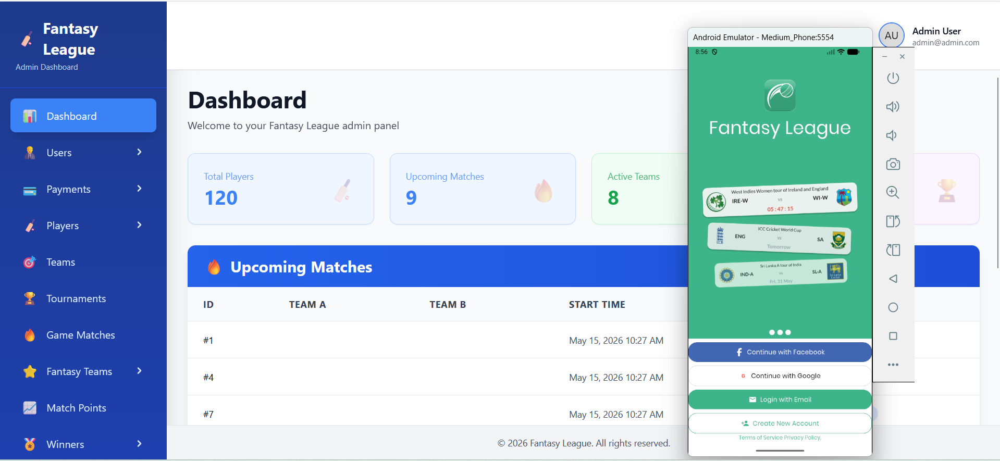

# Fantasy League Management Using Laravel, Vue and Flutter

Fantasy teams sports league management system using Laravel, Vue and User panel in Flutter.

## Development Environments
Backend:
1. Laravel Framework 12.49.0
2. Vue 3.4.0

Frontend:
1. Flutter 3.41.1
2. gradle-8.13, kotlin_version = '2.2.0', JavaVersion.VERSION_17

## How To Run
Backend:
1. Setup MySQL according to .env (Extra: Setup Mail configuration to run mail sending)
2. Run command "php artisan migrate:fresh --seed" for a fresh database and seeders every time (comment out any seeders in DatabaseSeeder.php if not needed)
3. Run command "php artisan serve" to run the application
4. Run command "npm run dev" for development, and "npm run build" for production build of the Vue codes.
5. Admin Login: email: admin@admin.com, password: 12345678
6. keep running "php artisan queue:work" for local, and use Supervisor for Linux server to run the queue jobs (like: email sending).

Frontend:
1. Run command "flutter pub get" for installing all the dependencies
2. Run command "flutter run --dart-define=APP_VERSION=1.0.1" to run the app in debug mode.
3. Run command "flutter build apk --dart-define=APP_VERSION=1.0.1" for production build (need to check both .env before build for production)
4. User Login: email: user@user.com, password: 12345678

## Admin Panel and User Mobile App At A Glance

## Contact
For any inquiries, reach out to me at [rajon.kobir@gmail.com](mailto:rajon.kobir@gmail.com).